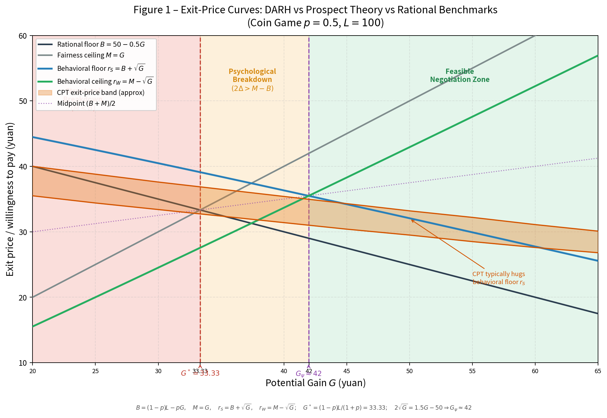
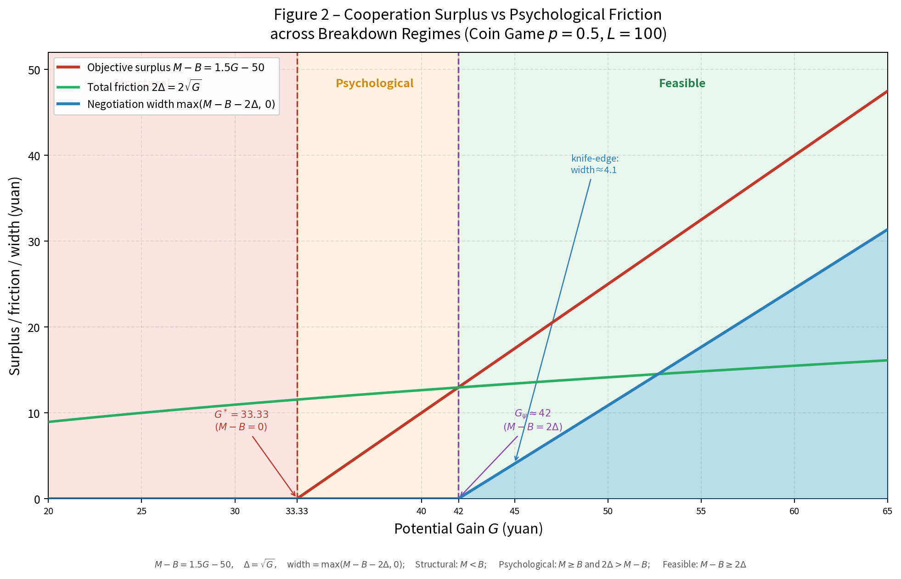
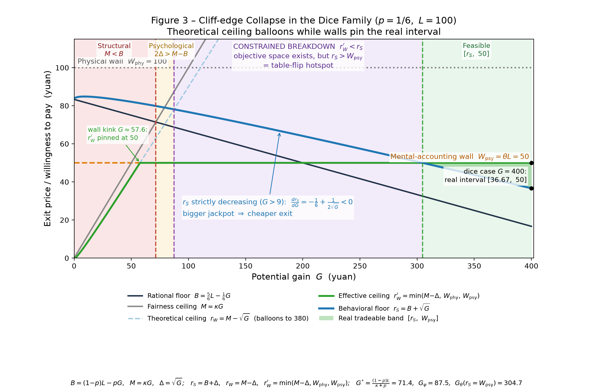

# A Story of Tossing a Coin: Why "Know It's a Bad Deal, Yet Have to Sign"
Behavioral Negotiation Model Under Fairness Constraints (DARH "Dual-Anchor Root-Heuristic Model", Dual-Anchor Root Heuristic Model, abbreviated **DARH Model** · v2.34 Merged Popular & Academic Edition).

## Abstract
Classical economics usually asks first: "What is the expected value of this bet? What's the most you'd pay to quit?" But the question more common in reality is actually: "I want to quit, but will the other party agree? Is there still a price between us that we could both accept?"

At the outset, this paper uses a coin-tossing example to explain: many deals "known to be unfavorable, yet signed under duress," are not because people are fools, but because the negotiation range has been squeezed by the rational floor, the fairness ceiling, and psychological friction down to a very narrow — even forced-to-accept — space. This paper upgrades "individual willingness to pay" into a "bilateral negotiation range," and provides a two-layer diagnostic framework for structural breakdown and psychological impasse.

Furthermore, under high-odds scenarios, the theoretical range exhibits "pathological expansion." Introducing a physical budget wall and a mental-accounting red line causes the range to undergo a cliff-edge collapse, thereby explaining the real-world phenomenon of "preferring to keep betting rather than accept an apparently negotiable exit price," and upgrades into a third type of breakdown — the constraint-induced breakdown.

## I. First, Ask an Inappropriate Question
Suppose you're out shopping with ¥100 in your pocket when a man who looks like a "big brother" stops you and says: "Bro, I've got a decent bet here:

Toss a coin.
Heads: you win ¥50.
Tails: you lose your ¥100 principal.

He puffs out his chest and says: "Bro, look, a coin only has heads and tails, the odds are 50-50, pretty fair, isn't it?"

 bull***t, fair my foot. The coin has no problem — the odds do. Unless he's willing to put up ¥250, AND the coin is mine, AND I have to watch him cheating with a two-tails coin.
So a simple calculation of the expected value of this bet makes things clear:

$$
EV = 0.5 \times 50 + 0.5 \times (-100) = -25. \qquad (1)
$$

That is, on average, you lose ¥25 every time you play. You should immediately realize — that guy takes you for a fool (a sucker, the meaning of that number, you all know). An expected value of −25 means any sane person knows not to play; just leave.

So here's the question: why don't I just walk away?

There's only one answer: someone is definitely blocking me — "You can go, but he has to give the nod."

So first you ask: "Bro, don't go looking for trouble today — consider us friends. I'll give you ¥10 to buy a pack of cigarettes, how about it?"

The big brother, knowing his expected return, would surely refuse.

At this point, you should not keep pushing:

> **"Then how much should I actually pay?"**

What you really should ask is:

> **"Is there even a price range between us that we could both accept?"**

That is:

> Is there a price that lets the other party feel it's worth letting go, while also making you feel it's worth paying to exit?

You can't end up two people rolling in the dirt on the sidewalk deciding whether you can run.

One aside: the question "how much should I pay" is not itself a bad question. What's bad is stopping there. The number you come up with, and the number the other party offers, happen to be exactly the "two ends of the range" we'll be talking about later — the real answer doesn't lie in any single number, but in whether a contract can fit in the space between those two numbers.
If so, negotiation is possible.
If not, the most polished negotiation skills can only get the two of you to the sidewalk and fighting faster.

## II. An Easily Misread Counterintuitive Phenomenon
First, an intuitive question. If we改 this bet to:
Heads: you win ¥100.
Tails: you lose your ¥100 principal.

All other conditions unchanged. Would the exit fee you're willing to pay go up or down? Many people's first reaction is: **my potential winnings** (expected returns) got bigger, so I should be more willing to pay to exit, right?

But note, there's a subtle change here. The original bet was +50/−100, with an expected value of −25; the new bet is +100/−100, with an expected value of 0. That is, the bet has gone from "clearly unfavorable" to a "fair gamble." Therefore, if what we're discussing is "how much am I willing to pay to escape this bet," the bet itself has become better, and the opportunity cost of continuing to hold it declines with it.

So:

> **The exit fee falling is not some mysterious psychological phenomenon. First, the bet itself got better.**

Of course, there's a deeper question here:

> **A "fair gamble" is not the same as a "gamble worth actively accepting."**

Because you didn't come running to place the bet yourself.
Someone pulled you in.

If the other party wants you to think this bet is attractive enough to stay voluntarily, he also has to offer you some **participation premium**.
**This is precisely one of the reasons lotteries can make people willingly pull out money to buy them: what people buy is not just a mathematical expectation, but an extremely low probability, yet enormously consequential possibility of changing one's fate.**

In other words:

**Negative expected value ≠ negative psychological value**

What's really interesting is another matter:

In reality, even if an agreement is still unfavorable, as long as it retains a bit of:

> **"Maybe I can win."**
> **"Maybe I can turn it around."**

people often refuse to cut their losses in time.

So what this paper truly wants to explain is not:

> **"Why does the exit fee fall after the odds improve?"**

but:

- Why do some **clearly unfavorable bets** still make people linger and not leave?
- Why do some **seemingly promising negotiations** completely fall apart?
- Why do some weaker parties end up signing an **agreement they know isn't that favorable**?

**This requires upgrading "individual willingness to pay" into a "bilateral negotiation range."**

And this, precisely, is the author **standing on the shoulders of Prospect Theory — that great edifice — attempting to complete a tiny bit of renovation with the DARH model.**

## III. In the Real World, the Exit Price Is Not a Point
If you only look at the risk-neutral expected value, many would give a crisp answer: "This bet ticket loses ¥25 on average, so the exit price is just ¥25." But real negotiation isn't like that. In the real world there are two hard boundaries.

### 3.1 The Opponent's Rational Floor: 25
The other party continues to hold this bet, and can earn ¥25 on average. So the opponent's theoretical minimum acceptable price is

$$
B = 25. \qquad (2)
$$

If you pay less than ¥25, the other party has no reason to let you go. He'd say: "Why should I let you walk for free? Keep playing, and I average ¥25 more. Trying to brush me off with ¥10 — am I a beggar to you?"

### 3.2 Your Fairness Ceiling: 50
Your bet ticket can win at most ¥50. If the party asks you to pay more than ¥50 to exit, you'll feel: "I can win at most ¥50, and now you want me to pay more than ¥50? That's not exiting, that's robbery." So ¥50 is your fairness ceiling:

$$
M = 50. \qquad (3)
$$

Above that number, many would rather keep betting.

### 3.3 The Coarse Range: 25 to 50
So, before introducing psychological friction at all, we can at least see a coarse range $[25, 50]$.
Below ¥25, the other party won't agree;
Above ¥50, you feel robbed.

But this still isn't the real, transactable range. Because real people leave a little "psychological buffer" at each end, so the range narrows further.

## IV. How to Quickly Calculate the Narrow Range: The Secret of "Root-50"
The key lies in a simple number

$$
\sqrt{50} \approx 7.07. \qquad (4)
$$

This 7.07 doesn't need to be derived from deep theory. It's simply "the square root of the ¥50 you can win." Its role is to shave ¥7.07 off each end of the original range.

**Table 1. Range Ends Under Symmetric Psychological Friction**

| Endpoint | Original Value | After Shaving $\sqrt{50}$ | Meaning |
| --- | --- | --- | --- |
| Strong-side floor | 25 | $25 + 7.07 = 32.07$ | The other party wants more than just the expected value — a bit of risk/psychological compensation |
| Weak-side ceiling | 50 | $50 - 7.07 = 42.93$ | Keeping a bit of risk/psychological buffer for oneself |

So the real behavioral negotiation range is not $[25, 50]$, but

$$
[32.07,\ 42.93],
$$

approximately $[32, 43]$.

### 4.1 Why "Shave an Equal Amount from Each End"?
Because this keeps the midpoint of the range unchanged. The midpoint of the original range $[25, 50]$ is 37.5. After shaving ¥7.07 from each end we get $[32.07, 42.93]$, and the midpoint is still 37.5. This corresponds to an assumption of symmetric psychological friction: the strong side asks for a bit more compensation; the weak side asks for a bit less deprivation; each side steps back a little, but the center of negotiation stays put.

### 4.2 Why Specifically "Square Root"?
Because the square root satisfies two very naive psychological traits.

(1) **It changes with returns.** The more you can win, $G$, the greater the psychological compensation should be:

$$
\Delta = \sqrt{G}. \qquad (5)
$$

If $G = 50$, then $\Delta \approx 7.07$; if $G = 100$, then $\Delta = 10$.

(2) **It has diminishing marginal returns.** Doubling the winnings doesn't double the compensation. For instance $\sqrt{50} \approx 7.07$, while $\sqrt{100} = 10$. The winnings doubled, but the psychological compensation rose only from 7.07 to 10. This exactly matches the popular intuition: "the more money you have, the less sensitive you are to the extra bit." The square root is the simplest number satisfying both conditions.

**Remember in one sentence:** $\sqrt{50}$ is not initially derived from cutting-edge theory through calculation, but is a simple judgment of the compensation mechanism — "you can win 50, but the psychological value of that 50 is discounted, down to 7-something." It happens to line up with the exact solutions of certain cutting-edge theories — this is a post-hoc validation, not a source. For small-scale scenarios, the square root is used because it's mentally calculable and intuitive; for large-scale or high-risk scenarios, you can switch to the dynamic-elasticity version (see Appendix J).

## V. The Range "Breathes": Two Ways to Fall Apart
One of the core ideas of the DARH model is that the negotiation range is not fixed — it gets compressed as psychological friction grows. In the symmetric psychological-friction version, let

$$
B = \text{rational floor}, \quad M = \text{fairness ceiling}, \quad \Delta = \sqrt{G},
$$

then the real behavioral range is

$$
[B+\Delta,\ M-\Delta]. \qquad (6)
$$

In the original problem $B = 25$, $M = 50$, $\Delta \approx 7.07$, so

$$
[25 + 7.07,\ 50 - 7.07] = [32.07,\ 42.93].
$$

The greater the psychological friction, the narrower the range. When psychological friction grows large enough to swallow the entire range, the negotiation breaks down. But "breaking down" comes in two entirely different types.

### 5.1 Structural Breakdown: No Rice in the Pot
The meaning of structural breakdown is: even without considering any psychological factors, there is no objective room for a transaction. The condition is simple:

$$
M < B. \qquad (7)
$$

That is, the highest price the weak party can accept is below the lowest price the strong party demands. Popularly, it means "can't." For example, $G = 25$, $L = 100$, $p = 0.5$. You can win at most 25, so the fairness ceiling is $M = 25$; the opponent's rational floor is $B = 37.5$. So $M < B$, can't negotiate. Think of it as: "there's simply no rice in the pot, you can't cook a meal out of it."

### 5.2 Psychological Impasse: Rice Is Enough, But Can't Carry It
The psychological impasse is more subtle. It means: objectively there is room for cooperation, but the psychological friction is so large that it crushes the negotiable range. In the symmetric psychological-friction version, the condition is

$$
M \geq B, \ \text{but}\ 2\Delta > M - B. \qquad (8)
$$

That is: there was a little room between the fairness ceiling and the rational floor, but after each side shaves a psychological buffer, the room is gone. Popularly: it's not that you can't negotiate at all, but that psychological pressure, a deficit of trust, and fairness anxiety have eaten up the negotiation space.

For example, $G = 35$, $L = 100$, $p = 0.5$. The strong side's floor is $B = 32.5$, the weak side's fairness ceiling is $M = 35$, and the objective cooperative surplus is only 2.5. But $\Delta \approx 5.92$, and both sides together shave off about 11.84, far exceeding the cooperative surplus. So the range is crushed. Think of it as: "there's a little rice in the pot, but the person is so hungry their hands are shaking they can't even lift the pot."

### 5.3 A Comparison of the Two Breakdowns
**Table 2. Comparison of Structural Breakdown and Psychological Impasse**

| Type | In One Sentence | Condition | Example | Popular Saying |
| --- | --- | --- | --- | --- |
| Structural Breakdown | No objective room | $M < B$ | Win 25, lose 100 | Can't |
| Psychological Impasse | Objective room exists, but psychological friction eats it | $M \geq B$ and $2\Delta > M-B$ | Win 35, lose 100 | Can't be bothered |

These two breakdowns must be diagnosed separately, because the remedies differ:
- **Structural breakdown** typically requires changing the payoff structure: raising $G$, lowering $L$, or introducing external compensation.
- **Psychological impasse** typically requires lowering psychological friction: building trust, introducing guarantees, phased exit, third-party witness, reducing uncertainty.

### 5.4 Diagram: Two Lines of Life and Death, and a Flattened Range
**Figure 1　Exit-Price Curve: DARH vs. Prospect Theory vs. Rational Baseline** (coin game $p = 0.5$, $L = 100$)

**Figure 2　Cooperative Surplus vs. Psychological Friction: Three Breakdown Ranges** (coin game $p = 0.5$, $L = 100$)

### 5.5 Understand Both Figures in 30 Seconds

**One, the 30-second telling:**
"You're forced into a losing bet and want to pay a breakup fee to exit, but the other party must agree. These two figures answer three questions: What's the least the other party will accept? What's the most you'll pay? Can the two of you reach a deal?

Classical economics says: yes, we can reach a deal, and the price is a single point.
Prospect Theory, Nobel laureate, says: people fear losses and will pay a bit more, but still a single point.
Our model says: the real world is not a single point, but a range — and this range gets 'flattened by emotion.' Flatten it to nothing, and the transaction collapses.

Those two dashed lines on the figure are two lines of life and death: 33.33 and 42."

**Two, Figure 1: One bad bet, three sets of lines, three color blocks**
First, the two "hard lines" (black, gray):
- **The black line goes down**: the least money the other party will accept. The bigger the prize, the less this bet is worth to them, the lower they'll ask.
- **The gray line goes up**: your psychological ceiling. "Whatever the most you can win is, the breakup fee can't exceed it; above that is robbing you."

Then the two "emotion lines" (blue, green):
- People aren't computers. The other party will ask for a bit more (blue), and you'll want to pay a bit less (green); this "emotion markup" is roughly the square root of the amount you can win ($\sqrt{G}$).
- The blue and green lines are like a pair of scissors: only when the scissors open is there room to talk; when they're closed, it falls apart.

Finally, the three color blocks (this is the soul of the whole figure):
- **Red block (left)**: your ceiling is lower than their floor — "no rice in the pot," and even a god can't negotiate.
- **Orange block (middle)**: objectively a little room, but once both sides add emotion, the room is crushed — "enough rice for a bowl, but the two of them quarrel until they flip the pot."
- **Green block (right)**: the scissors open, a deal is possible.

Point to the orange band:
"This orange band is the 'single-party willingness to pay' that Nobel-calibrated Prospect Theory computes. Notice it clings tightly to our blue line (the lower bound of the bilateral range). This is not a mere numerical coincidence, but reveals deeply the dilemma of real negotiation: the weak party's 'willingness to pay' just reaches — or even falls short of — the strong party's 'floor plus psychological markup.' DARH makes this mismatch between 'single-party intent' and 'bilateral floor' explicit, explaining why deals that should succeed theoretically are so prone to collapse in reality."

**Three, Figure 2: Reason line vs. Emotion line**
This figure is simpler, with only three lines, one sentence each:
- **Red line = reason**: how much objective "room to concede" this deal has (how big the pie is).
- **Green line = emotion**: the total cost of both sides' psychological friction (how expensive the emotion is).
- **Blue line = outcome**: pie minus emotion; what's left is the room that can actually be negotiated.

Then the three regions:
- Red line below 0 (left of 33.33): the pie doesn't exist, what's there to negotiate?
- Red line below the green line (33.33 ∼ 42): the pie exists, but is smaller than the emotion, so it still breaks down.
- Red line above the green line (42 on): it can negotiate. But note that when the blue first appears it's only a thin sliver (at 45 it's only about ¥4 wide) — negotiable ≠ easy to negotiate; the room is so thin a gust of wind blows it away. This is why so many "theoretically completable" deals still fall through in reality.

**Four, which theories are we comparing against?**
**Table 3. Theory Comparison**

| Theory | What It Computes | What It Looks Like in the Figure | What It Can't Explain |
| --- | --- | --- | --- |
| Classical rational actor (expected value + Nash bargaining, game theory) | A "fair price" point | The intersection of the black and gray lines in Fig 1; the red line in Fig 2 "imagining the green line doesn't exist" | Why "deals that should succeed" don't; why price is a range |
| Prospect Theory (Kahneman & Tversky, 2002 Nobel) | How much a loss-fearer will pay | The orange band in Fig 1 | Whether two sides can reach a deal; the two different kinds of "breaking down" |
| DARH (this model) | Negotiable range + two breakdown boundaries | Blue-green scissors lines + three color blocks in Fig 1; red-green-blue three lines in Fig 2 | (It's the one being validated) |

"Classical theory governs 'should or shouldn't,' Prospect Theory governs 'afraid or not,' and we govern 'can it be negotiated, and when does it break down.' The three are not mutually exclusive, but successive."

**Five, laypeople only need to remember two numbers**
**First set: look at the prize (the most you can win)**
- **¥33.33 — the "pie line"**: if the other party says "that's the most you'll ever win," and this number is below 33.33, then the pie doesn't exist; under normal circumstances, no negotiation skill can save you.
- **¥42 — the "emotion line"**: the prize must be above about 42 for the negotiation space to truly open; between 33.33 and 42 is "visible but untouchable" — objectively a little crack, but most of the time crushed by the two sides' emotion.

**Second set: look at the exit fee (using prize = ¥50 as example)**
- **¥25**: the money the other party can average making it; below this number, they basically won't talk to you at all.
- **¥32**: ¥25 plus about ¥4 of psychological markup ($\sqrt{50}$); if their ask is around this number, it's reasonable.
- **¥32 ∼ 43**: the last remaining sliver. Whether you close the deal depends on your risk aversion and communication skills; the closer to 43, the more likely to blow up on the spot.
- **Above ¥43**: most people would directly toss the coin at this point — they feel they're paying more than the most they can win, and to anyone's eyes that's being robbed.

**Closing summary:**
"What this figure wants to say, in plain terms, is one plain sentence — many deals break down not because nobody will concede, but because the emotion is more expensive than the room."

## VI. Why Will People Sign "Known-Unfavorable" Agreements?
This is what DARH most wants to explain. Standard models often assume: if an agreement is worse than not participating, a rational actor won't sign it. But in reality there really are many agreements that look like "knowing it's unfavorable, yet having to sign." For example:
- Laborers accepting clearly unfavorable pay cuts;
- Debtors accepting high-cost debt restructuring;
- Small suppliers accepting long payment terms from dominant core firms;
- Tenants accepting unreasonable rent hikes upon lease renewal;
- Entrepreneurs accepting onerous financing terms before cash flow breaks.

DARH's explanation is: whether the weak party signs depends not only on "whether the agreement is ideal," but also on "whether the alternative of exiting or refusing is even worse."

In the original problem, the behavioral negotiation range is $[32.07, 42.93]$. If the weak party's bargaining power is very weak, the strong party can push the price close to 43. At this point the weak party might think:

"This price is very unfair. But if I don't sign and keep betting, it may get worse. As long as I haven't crossed my final red line of 43, I have to accept."

So an agreement that is clearly unfair can still go through. This is one generation mechanism of "knowing it's unfavorable, yet having to sign." It's not because the person is foolish, but because the structure has compressed the space of choice.

## VII. Transaction Price: Bargaining Power
If the negotiation range $[r_S,\ r_W]$ exists, the final transaction price depends on both parties' bargaining power. Adopting a linear bargaining rule:

$$
C^* = \beta r_S + (1-\beta) r_W, \qquad \beta \in [0,1]. \qquad (9)
$$

where $\beta$ denotes the weak party's bargaining power.
- $\beta = 1$: weak party has strong bargaining power, price approaches the lower bound;
- $\beta = 0$: strong party has strong bargaining power, price approaches the upper bound.

In the original problem $r_S = 32.07$, $r_W = 42.93$, so

$$
C^* = 32.07\beta + 42.93(1-\beta).
$$

If $\beta = 1$, then $C^* = 32.07$; if $\beta = 0$, then $C^* = 42.93$; if $\beta = 0.5$, then $C^* = 37.5$, exactly the range midpoint.

## VIII. Real-World Correction: High-Odds Temptation, Budget Walls, and Mental Accounting (DARH v2.21–v2.34)
In the symmetric psychological-friction model, we have already obtained a fairly complete theoretical framework. This framework works reasonably well in medium-odds, medium-probability scenarios. But as you read this far, don't you feel something is still a little off? That feeling is correct, because once you enter high-odds scenarios, the theoretical range exhibits a kind of "pathological expansion."

**Note**: For ease of comparison, the examples in this section uniformly adopt the static psychological friction $\Delta = \sqrt{G}$. Appendix J and the comparison table at the end will display the dynamic-elasticity version, to verify the robustness of the conclusions.

### 8.1 High-Odds Scenario: The Dice Game
If tossing a coin is "medium probability, medium odds," then many real-world scenarios are more like "extremely low probability, extremely high odds": buying lottery tickets, buying deep out-of-the-money options, gambling against a bet by an underlying entrepreneur, high-risk project financing, low-probability second-chance negotiations.

Suppose the player's principal is $L = 100$. Now it's not a coin, but a six-sided die:
- Rolling 1–5, probability 5/6: lose the ¥100 principal;
- Rolling 6, probability 1/6: win a prize $G = 400$.

The expected value of this bet is

$$
EV = \tfrac{1}{6}\times 400 - \tfrac{5}{6}\times 100 = 66.67 - 83.33 = -16.67.
$$

So this is still an unfavorable bet.

Under the symmetric psychological-friction model:

$$
B = |EV| = 16.67, \quad M = G = 400, \quad \Delta = \sqrt{G} = 20.
$$

So the theoretical behavioral range is

$$
[B+\Delta,\ M-\Delta] = [36.67,\ 380].
$$

Theoretical diagnosis: the range is extremely wide. With "a chance to win 400" firmly in hand, the player is, theoretically, very reluctant to exit. If one applied the pure mathematical model, the organizer demanding an exit fee of 200 or 300 would seem to fall within the range.

But this is clearly arm-chair reasoning.

### 8.2 The Pathological Expansion: Why Does the Range Lose Control?
In high-odds scenarios, because $M = G$, when $G$ is large the fairness ceiling gets inflated very high; while the psychological friction $\Delta = \sqrt{G}$ grows only sublinearly (e.g., by a square root). So the range width is approximately $M - B - 2\Delta$. When $G$ is large, $M$ expands linearly while $\Delta$ grows very slowly, so the theoretical range grows wider and wider, until it detaches from reality.

In the dice case, $[36.67, 380]$ is mathematically valid, but in reality almost unbelievable — someone with only ¥100 in their pocket (if any reader thinks we could make it hold by having the player take a loan, that is a matter for a later corrected version; here we discuss only the ¥100 constraint), could not pull out a near-upper-bound value, say ¥300, to exit. So a real-world correction must be introduced.

### 8.3 The Wall of Sighs in Reality: Two Hard Constraints
In the real world, the weak party's behavioral upper bound cannot be described by $r_W = M - \Delta$ alone. It must also crash into two "Walls of Sighs."

**The first wall: the physical ceiling.** Let the wealth the player can pay at once be $W_{\text{phy}}$. In this example $W_{\text{phy}} = 100$. No matter how high the theoretical upper bound, the exit fee cannot exceed what they can hand over right now:

$$
C \leq W_{\text{phy}}.
$$

*Note: The weak party's fairness intuition is naturally bounded by their total wealth constraint. Therefore, the actual effective fairness ceiling is $M_{\text{eff}} = \min(G, W_{\text{phy}})$. The physical budget wall is not a rigid external constraint, but the natural boundary of fairness intuition under extreme wealth inequality.*

**The second wall: the mental-accounting red line.** Even if the player can physically hand over ¥100, that doesn't mean they're psychologically willing to. When the ¥100 is already in the player's pocket, it has entered "mental accounting." Let them hand over ¥10 or ¥20, and they might feel "paying for peace of mind, painful but bearable"; but if asked to hand over more than half the principal, loss aversion gets strongly activated. They'd rather toss the die and gamble than swallow this indignity.

Therefore, mental accounting forms a wall that comes earlier than the physical budget. We parameterize it as

$$
W_{\text{psy}} = \theta L, \qquad 0 < \theta \leq 1.
$$

In the popular version, the default heuristic value $\theta \approx 0.5$ is taken, so $W_{\text{psy}} = 50$. Note: this 50% is not a theorem, but a calibratable empirical parameter, indicating that when a certain loss approaches half the principal, many people trigger a strong "refuse to pay" response.

### 8.4 The Cliff-Edge Collapse of the Range
After introducing the correction, the weak party's real behavioral upper bound becomes

$$
r_W' = \min(M-\Delta,\ W_{\text{phy}},\ W_{\text{psy}}).
$$

In the dice case:

$$
M-\Delta = 380, \quad W_{\text{phy}} = 100, \quad W_{\text{psy}} = 50,
$$

so $r_W' = 50$. The strong side's behavioral floor remains $r_S = B + \Delta = 36.67$. Therefore the real transactable range is

$$
[36.67,\ 50].
$$

The original theoretical range $[36.67, 380]$ undergoes a cliff-edge collapse in reality. The range hasn't disappeared, but it's been locked down tightly by the two Walls of Sighs.

### 8.5 Explaining the "Table-Flipping" Behavior in Reality
- **Organizer asks for 40**: falls within $[36.67, 50]$. The player will be meat-pained (wincing), but may still grit their teeth and agree (the physical budget and mental red line are not breached, and ¥60 remains salvageable). Result: wincing, but dealable.
- **Organizer asks for 50**: exactly equals $W_{\text{psy}}$, the critical point. The weak party is nearly squeezed to their mental red line.
- **Organizer asks for 60**: breaches the mental-accounting red line. The player will very likely refuse outright: "I'd rather gamble than pay this." Old theory would be puzzled — 60 is far less than the theoretical upper bound of 380, why refuse? DARH's explanation is: the real transactable range has been locked down by the two Walls of Sighs to $[36.67, 50]$, and 60 is way beyond the real upper bound. This is not a constraint-induced breakdown (the range still exists), but rather an **at-the-behavioral-level rejection of the mental red line**.

### 8.6 An Upgraded Version of the Three Breakdowns
**Table 4. Comparison of the Three Breakdowns**

| Type | Condition | Meaning | Popular Saying |
| --- | --- | --- | --- |
| Structural Breakdown | $M < B$ | Fairness ceiling below rational floor, objectively no room | No rice in the pot |
| Psychological Impasse | $M \geq B$ but $2\Delta > M - B$ | Objective room exists, but bilateral psychological friction eats it | Rice is enough, but can't carry it |
| Constraint-Induced Breakdown | $r_W' < r_S$ | Neither the theory nor the psychological friction kills the deal, but the physical budget or mental accounting pushes the upper bound below the floor | Want to sign, but no money in the pocket; or can't get over it in the heart |

where

$$
r_W' = \min(M-\Delta,\ W_{\text{phy}},\ W_{\text{psy}}).
$$

### 8.7 Parameterization: The Mental Red Line Is Not a Fixed 50
A more general writing is $W_{\text{psy}} = \theta L$ (or $W_{\text{psy}} = \theta W_{\text{phy}}$), with $\theta \in [0,1]$ denoting the "psychologically acceptable loss ratio of mental accounting."

In the dice case $r_S = 36.67$, and the dealable condition is $\theta \times 100 \geq 36.67$, i.e., $\theta \geq 0.3667$. Therefore:
- $\theta < 0.3667$: constraint-induced breakdown;
- $\theta \approx 0.3667$: critical, dealable;
- $\theta = 0.5$: real range $[36.67, 50]$;
- $\theta = 0.8$: real range $[36.67, 80]$;
- $\theta = 1$: real range $[36.67, 100]$.

The mental red line directly determines whether the high-odds gamble can go through.

### 8.8 Relationship with Prospect Theory
This chapter continues to deepen Prospect Theory. Prospect Theory can still explain why small probabilities are over-weighted, why people are especially sensitive to losses, and why certain losses produce sharp pain. What DARH adds is: even if Prospect Theory gives a willingness to pay, the real transaction must still pass through budget constraints and mental-accounting walls.

The relationship among the three is:

$$
\text{psychological value} \longrightarrow \text{negotiation range} \longrightarrow \text{real-wall constraint}.
$$

### 8.9 Comprehensive Diagnosis Table (Dice Case)
**Figure 3　Dice-Family Regime Map: Cliff-Edge Collapse** (dice game $p = 1/6$, $L = 100$)

(The regime map for the dice case — the rational floor $r_S$, the theoretical upper bound $r_W$, and the real walls $W_{\text{phy}}$, $W_{\text{psy}}$ are juxtaposed on one figure, with the geographic distribution of the three regimes — structural breakdown, psychological impasse, and constraint collapse — marked. It pairs with Table 5 below as the geometric image and the algebraic diagnosis.)

**Table 5**

| Level / Stage | Theoretical Formula | Dice Case Value | Real-World Correction | Result |
| ------- | ------------------------------------------------------- | -------------- | ------- | -------- |
| Expected value | $EV = pG - (1-p)L$ | −16.67 | Unchanged | Unfavorable bet |
| Rational floor | $B = \|EV\|$ | 16.67 | | |
| Fairness ceiling | $M = G$ | 400 | Unchanged | Weak party's anti-exploitation upper bound |
| Psychological friction | $\Delta = \sqrt{G}$ | 20 | Expandable to dynamic elasticity | Bilateral psychological buffer |
| Behavioral lower bound | $r_S = B + \Delta$ | 36.67 | Unchanged | Strong side's behavioral floor |
| Theoretical behavioral upper bound | $r_W = M - \Delta$ | 380 | Too high theoretically | Pathological expansion |
| Theoretical range | $[B+\Delta,\ M-\Delta]$ | $[36.67, 380]$ | Range too wide | Doesn't match reality |
| Physical wall | $C \leq W_{\text{phy}}$ | 100 | Budget constraint | 380 is unpayable |
| Mental wall | $C \leq W_{\text{psy}} = \theta L$ | 50 | Mental-accounting red line | Actual upper bound |
| Real upper bound | $r_W' = \min(M-\Delta, W_{\text{phy}}, W_{\text{psy}})$ | 50 | Range collapse | Real upper bound is locked down |
| Real range | $[r_S,\ r_W']$ | $[36.67, 50]$ | Real-world negotiable range | Clearly narrowed |
| Ask 40 | $36.67 \leq C \leq 50$ | Dealable | Wall not breached | Wincing but signable |
| Ask 50 | $C = W_{\text{psy}}$ | Critical | Mental red-line boundary | Barely signable |
| Ask 60 | $C > W_{\text{psy}}$ | Not dealable | Constraint-induced breakdown | Player rather gambles |

**Table 6　Elasticity Assumption Comparison (Static vs. Dynamic)**
The table juxtaposes the static-elasticity (main-text baseline) with the dynamic-elasticity (Appendix J, power-law exponent > dynamic elasticity $\Delta(S)$ (Appendix J, local elasticity at the dice case $\varepsilon(S) \approx 0.73$, global effective exponent $\approx 0.63$).
Two assumptions are juxtaposed to show the conclusion:

| Item | Static elasticity $\sqrt{G}$ (main-text baseline) | Dynamic elasticity (Appendix J, integrated solution substituting $S$) |
| ----------------- | --------------------- | --------------------------------------------- |
| Dice-case $\Delta$ | $20$ | $\approx 10.4$ ($\varepsilon(S) \approx 0.73$) |
| $r_S$ ($G=400$) | $36.67$ | $\approx 27.1$ |
| $r_W'$ | $50$ (wall-clamped) | $50$ (wall-clamped, independent of $\Delta$) |
| Real range | $[36.67,\ 50]$ | $[\approx 27,\ 50]$ (wider) |
| $G^*$ (structural) | $71.4$ | $71.4$ (independent of $\Delta$) |
| $G_\psi$ (psychological) | $\approx 87.5$ | $\approx 86.6$ (almost unchanged) |
| $G_\theta$ (right end of constraint band) | $\approx 304.7$ | $\approx 258$ |
| Four-stage / Corollary 8.1 | Survives | Survives ($r_S$ has stronger monotonicity) |

## IX. The Contribution Boundaries of This Paper: What's Borrowed, What's Ours
To avoid exaggeration, this paper explains its contributions in layered tiers.

**Table 7. Contribution Layering**

| Level | Content | Nature |
| --- | --- | --- |
| L0 | Expected value, risk aversion, prospect theory, loss aversion | Existing theory |
| L1 | Landing loss aversion into the scenario of "wanting to exit after holding an unfavorable position" | Application / reconstruction |
| L2 | Extending the exit problem from "individual willingness to pay" to a "bilateral negotiation range" | Key extension |
| L3 | The square-root heuristic, the two-layer structural/psychological breakdown, the range-breathing mechanism | This paper's main contribution |
| L4 | The budget wall under high odds, the mental-accounting red line, constraint-induced breakdown, the cliff-edge collapse of the range | Real-world correction extension |

In other words, this paper is not reinventing Prospect Theory. What this paper does is: take the existing behavioral-economics concepts and assemble them into a negotiation-range model that explains "forced signing," and further use real-world constraints to explain table-flipping behavior in high-odds scenarios. Its core is not to compute a precise number, but to answer:
- Under what conditions can still negotiate?
- Under what conditions will definitely fall apart?
- Does the breakdown come from structural failure, or from too much psychological friction, or from crashing into a real wall?
- Why do weaker parties sometimes have to accept unfavorable agreements?

## Appendix: Formula Derivation and Verification
The following is aimed at reviewers and meticulous readers. The main text uses the "symmetric psychological friction" popular version; this section gives the model setup, derivation, numerical tables, and verification.

### A. General Model Setup
Let the weak party hold the following risky position:

$$
X = \begin{cases} +G, & \text{probability } p, \\ -L, & \text{probability } 1-p, \end{cases} \qquad (A1)
$$

where $G > 0$, $L > 0$. This bet is an unfavorable one:

$$
EV = pG - (1-p)L < 0,
$$

i.e., $(1-p)L > pG$. The weak party wishes to pay an exit cost $C$ to terminate the game, and the strong party decides whether to accept.

### B. Two Key Anchors
**B.1 Strong side's rational floor.** Assume the strong party is risk-neutral and requires at least the expected return from continuing the game. Their reservation price is

$$
B = (1-p)L - pG. \qquad (A2)
$$

Since $EV < 0$, we have $B = |EV| > 0$.

**B.2 Weak side's fairness ceiling.** The weak party has a fairness constraint or anti-exploitation preference, believing that the exit cost should not exceed the maximum possible gain. Let

$$
M = \kappa G, \qquad 0 < \kappa \leq 1. \qquad (A3)
$$

The default case is $\kappa = 1$, i.e., $M = G$. This means: the weak party can accept paying a certain premium to exit the risk, but refuses to pay an exit price exceeding the potential maximum gain.

### C. Symmetric Psychological-Fiction Version
The main text adopts symmetric psychological friction $\Delta = \sqrt{G}$. The strong side's behavioral floor is $r_S = B + \Delta$, the weak side's behavioral upper bound is $r_W = M - \Delta$, and the negotiable range is

$$
Z = [r_S,\ r_W] = [B+\Delta,\ M-\Delta]. \qquad (A4)
$$

In the original problem $p = 0.5$, $L = 100$, $G = 50$, so $B = 25$, $M = 50$, $\Delta \approx 7.07$, and the negotiable range is $[32.07, 42.93]$.

### D. Structural-Breakdown Critical Point
The structural-breakdown condition is $M < B$. Substituting gives the critical winning amount

$$
G^* = \frac{(1-p)L}{\kappa + p}. \qquad (A5)
$$

Substituting $p = 0.5$, $L = 100$, $\kappa = 1$ gives $G^* \approx 33.33$. Therefore $G < 33.33 \Rightarrow$ structural breakdown.

### E. Psychological-Impasse Critical Point
In the symmetric psychological-friction version, the psychological-impasse condition is $M \geq B$ but $2\Delta > M - B$. Under $p = 0.5$, $L = 100$, $\kappa = 1$, the critical $G$ solves to $\approx 41.97$. Therefore:
- $33.33 \leq G < 41.97 \Rightarrow$ psychological impasse;
- $G \geq 41.97 \Rightarrow$ a negotiable range exists.

### F. Numerical Table (Coin-Tossing Scenario)
Let $p = 0.5$, $L = 100$, $\kappa = 1$.

**Table 8. Negotiation Range and Breakdown Type Under Different Winning Amounts $G$**

| $G$ | $B$ | $M$ | $M - B$ | $\Delta$ | $r_S$ | $r_W$ | Result |
| --- | --- | --- | --- | --- | --- | --- | --- |
| 25 | 37.5 | 25 | −12.5 | 5.00 | 42.50 | 20.00 | Structural Breakdown |
| 35 | 32.5 | 35 | 2.5 | 5.92 | 38.42 | 29.08 | Psychological Impasse |
| 40 | 30 | 40 | 10 | 6.32 | 36.32 | 33.68 | Psychological Impasse |
| 42 | 29 | 42 | 13 | 6.48 | 35.48 | 35.52 | Dealable critical point (psychological breakdown boundary) |
| 50 | 25 | 50 | 25 | 7.07 | 32.07 | 42.93 | Dealable: $[32.07, 42.93]$ |

### G. Cross-Validation with Prospect Theory
DARH is not trying to replace Prospect Theory; it is a simplified, interpretable, negotiation-range-oriented heuristic. Prospect Theory's value function is usually written as

$$
v(x) = \begin{cases} x^{\alpha}, & x \geq 0, \\ -\lambda(-x)^{\alpha}, & x < 0, \end{cases}
$$

with common parameters $\alpha \approx 0.88$, $\lambda \approx 2.25$. Under the original problem's parameters, Prospect Theory yields an exit willingness to pay somewhere between 30 and 33. DARH's behavioral range is $[32.07, 42.93]$, so Prospect Theory generally clings to the lower boundary of the range. DARH's value does not lie in precisely fitting a single point, but in delivering a negotiation range, a breakdown type, and the conditions under which the weak party is forced to accept an agreement.

### H. Transaction Price: Bargaining Power
If a negotiation range exists, the final transaction price is

$$
C^* = \beta r_S + (1-\beta) r_W, \qquad \beta \in [0,1],
$$

where $\beta$ denotes the weak party's bargaining power.

### I. Full-Form Extension: Bilateral Psychological-Fiction Parameterization
A more general writing is

$$
r_S = B + \eta_S \Delta, \qquad r_W = M - \eta_W \Delta, \qquad \eta_S, \eta_W \in [0,1].
$$

The dealable condition is $M - B \geq (\eta_S + \eta_W)\Delta$.

### J. Dynamic-Elasticity Extension: From Small-Scale Square Root to Large-Scale Sublinear
The main text uses $\Delta = \sqrt{G}$, suited to small-scale, everyday, mentally-calculable scenarios. Under large-scale or survival-level risk, one can introduce dynamic elasticity. Define the total psychological exposure

$$
S = \pi_+(p)G + \pi_-(1-p)\lambda L.
$$

Choose a reference baseline $(S_0, \Delta_0)$, and let the local elasticity be

$$
\varepsilon(S) = \begin{cases} \gamma_{\text{base}}, & S \leq S_0, \\ \gamma_{\max} - \big(\gamma_{\max} - \gamma_{\text{base}}\big)\Big(\dfrac{S_0}{S}\Big)^{\omega}, & S > S_0, \end{cases}
$$

with commonly taken values $\gamma_{\text{base}} = 0.5$, $\gamma_{\max} = 1$. For the small-scale range ($S \le S_0$), the square-root heuristic is retained; for the large-scale range, the elasticity gradually rises, and within the limited observed range the local elasticity is about $0.73$ (e.g., at $S/S_0 \approx 1.85$ in the dice case), while the theoretical asymptotic value tends toward $1$ (linear growth). This growth, although faster than a pure square root, is still insufficient to counter the linear expansion brought by $M = G$, thereby causing the pathological expansion of the theoretical range.

**Dynamic-Elasticity Model · Integrated Solution (the $\omega = 1$ case)**
When the local-elasticity parameter $\omega = 1$, the dynamic-elasticity formula is integrable, yielding a closed-form integrated solution:

$$
\Delta(S) = \Delta_0 \cdot \sqrt{\frac{S}{S_0}} \cdot \exp\left[\frac{1}{2}\left(\frac{S_0}{S} - 1\right)\right], \qquad (S_0,\Delta_0) = (137.5,\ \sqrt{50})
$$

**Calibration baseline**
The parameters $(S_0,\Delta_0)$ are pinned to the coin flagship game. Under linear weights:

$$
S_0 = 0.5 \times 50 + 0.5 \times 2.25 \times 100 = 137.5
$$

$$
\Delta_0 = \sqrt{50}
$$

## X. Final Summary
Compress this model into one sentence:
**DARH is not computing "how much one person is willing to pay," but "whether the two sides still have any chance of reaching a deal."**

It splits exit negotiation into layers:
- **Rational layer**: the strong side won't go below the expected return $B = |EV|$.
- **Fairness layer**: the weak side rejects a deprivation exceeding the maximum gain $M = G$.
- **Psychological layer**: psychological friction compresses the dealable range $\Delta \approx \sqrt{G}$.
- **Real-world layer**: the physical budget wall and the mental-accounting red line further lock down the upper bound, producing constraint-induced breakdown.

In the symmetric psychological-friction version, the negotiable range is $[B+\Delta,\ M-\Delta]$. If $M < B$, structural breakdown; if $M \geq B$ but $2\Delta > M - B$, psychological impasse; if the real upper bound $r_W' < r_S$, constraint-induced breakdown. Only when all three breakdowns fail to occur can negotiation succeed.

**Key Insight**
Many seemingly "irrational" signing behaviors need not mean the party got the math wrong. More likely:
Under their constraints, the selectable range has been compressed down to leaving only an unfair but bearable outcome.
This is precisely the mechanism behind "knowing it's unfavorable, yet having to sign."

## Open-Correction Protocol and Theoretic Lineage (DARH 2.34 · OCL v1.0)

### Open-Source Declaration
This is a simple early draft, and any proposals for better correction are welcome — the contributor's contributions belong entirely to the contributor, and the author claims no exclusive rights. All of this paper's models, formulas, numerical tables, and Markdown documents are freely open, and may be freely used for research, teaching, publication, commerce, or any other purpose, without permission and without payment. This is not the final draft. The value of discussion does not lie in "settling a verdict," but in whether it can be better corrected.

- **Contribution attribution**: Any subsequent correction, improvement, refutation, or extension by others — copyright and scholarly contribution belong to the subsequent contributor.
- **Tracing (voluntary)**: When citing, reprinting, or deriving, please mark the meta-paper version DARH 2.34 for tracing, if willing.
- **Closed-source (not required)**: The author does not require derivative works to be open-source; if open-sourced, please follow this protocol.
- **Disclaimer**: This is an un-finalized peer-reviewed draft; the conclusions are given according to the author's "best understanding at the time," with no guarantee of accuracy; consequences of adoption are borne by the adopter and the contributor.

### Theoretic Lineage: DARH and the Classics
This paper does not replace any classical theory, but extends, specifies, or explains the deviations from them in reality. As a possible interpretive framework, the table below marks each point of borrowing and derivation.

**Table 9. Theoretic Lineage: DARH and the Classics**

| Classical Reference | Original Theory | DARH's Correspondence and Extension | Level |
| ---------------------------------- | ------------------------------------------------ | ------------------------------------------------------------------------- | ------ |
| Rubinstein (1982) Alternating Offers Model | Time-discount factor $\delta$ in alternating offers | A premium $\Delta$ driven by psychological exposure $S$, analogizing and reinterpreting how rational discounting compresses negotiation space | L3 |
| Nash (1950) Bargaining Solution | The bargaining solution maximizing $(r_S - C)^\theta (r_W - C)^{1-\theta}$ | Compressing the classic feasible set into an $S$-drift behavioral range $[B+\Delta,\ M-\Delta]$ — retaining Nash structure as its linearized approximation, injecting behavioral friction | L2, L3 |
| Fehr–Schmidt (1999) Aversion to Inequity | The parameter $\alpha$ for aversion to inequitable outcomes | Specifying $\alpha$ into a calibratable hard fairness ceiling $M$ — landing the abstract parameter onto an observable red line | L2 |
| Kahneman–Tversky (1979, 1992) Prospect Theory | Value function and decision weights under single-person decisions | Not replacing CPT, but extending it from "single-person decisions" to "bilateral negotiation," and pushing loss aversion to negotiation-breakdown diagnosis | L0, L2 |
| Myerson (1981) Optimal Mechanism | Optimal mechanism squeezes the other party to the information-rent limit | Pointing, via the two-layer (and three-layer) breakdown diagnosis, that fairness, psychological friction, and real walls often cause real negotiations to fail before reaching the theoretical limit — supplementing optimal mechanism's "behavioral blind spot" | L4 |
| ZOPA / BATNA (Fisher & Ury 1981) | The dealable range between both parties' reservation prices; the alternative determines bargaining power | The direct predecessor of "bilateral negotiation range"; this paper's increment: injecting behavioral friction $\sqrt{G}$ onto the range ends, and providing a breakdown typology diagnosis | L2 |
| Thaler (1985, 1999) Mental Accounting | Funds are classified by mental account, and loss sensitivity varies by account | The direct source of the $W_{\text{psy}} = \theta L$ red line and constraint-induced breakdown | L4 |

---
**DARH v2.34 Academic-Popular Merged Edition · Open-Correction Protocol OCL v1.0**
The value of discussion does not lie in settling a verdict, but in whether it can be better corrected.

The author is not a scholar or a researcher in a relevant field, merely someone who, after reading certain theories, wished to extend their personal understanding of them, and to propose a reasonably suitable explanation within the scope of their own understanding. During the writing process, AI tools were used to help organize ideas, deduce some complex equations, and standardize wording for certain expressions. All core viewpoints, structural trade-offs, ethical boundaries, and the final draft are the author's own responsibility.

**Author**: Sisyphuswan
**Date**: 2026/8/29
**Contribution versions**: V0–V2.34
